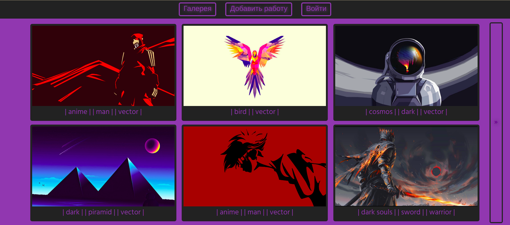

# site-portfolio

### Проект создан для демонстраци портфолио графического дизайнера.

### На текущий момент реализовано:
- страница "об авторе";
- галерея работ;
- фильтр работ по тегу;
- просмотр работы;
- добавление работы (для администратора);
- редактирование работы (для администратора);
- авторизация зарегистрированных пользователей (регистрация доступна в административной панели Django);
- авторизация/регистрация через социальную сеть VK.

### Первая версия проекта

### Для локального развертывания необходимо:
- установить Python (https://www.python.org/downloads/);
- установить Poetry (https://python-poetry.org/docs/#installation);
- перейти в директорию проекта и выполнить команды:  
`git clone https://github.com/Spartan327/site-portfolio.git`  
`poetry install`  
`poetry run python manage.py runserver` или `poetry run python3 manage.py runserver`
- перейти по адресу (http://127.0.0.1:8000/)

Для входа от имени админиcтратора используйте следующие учетные данные  
логин: `admin`  
пароль: `12345`
